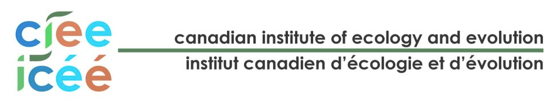

## Workshop summary
Extreme climate-related events (ECEs) including fires, floods, heatwaves, and storms, are increasing in frequency across Canada and worldwide.  Evolutionary theory predicts that these events can have severe consequences for populations, including reduced genetic diversity, increased inbreeding, and diminished capacity for ongoing adaptation. However, temporal datasets assessing genetic diversity before and after ECEs have found little evidence for the predicted declines in genetic diversity. This lack of effect may signal a high degree of genetic resistance or resilience to ECEs across diverse wildlife populations, but alternatively, may reflect the small number of studies to date, their ad hoc nature (ECEs are inherently unpredictable), or limitations arising from the type or amount of data used to investigate their effects. This working group brings together a diverse group of theoretical and empirical biologists and conservation practitioners to extend our understanding of the genetic consequences of ECEs and to provide guidelines for empirical investigation of these events. 

The proposed one-week in-person working group will take place in Paahtómahksikimi (Waterton Lakes National Park, WLNP, and the Blood Timber Reserve in SW Alberta), home of many species of conservation concern and the location of a recent, severe ECE. Guided by a recent synthesis of empirical case, the working group will develop a theoretical framework for studying the genetic consequences of ECEs. Participants will then use a rare before-after, control-impact genomic dataset to apply this framework to a species of conservation concern in Paahtómahksikimi and for which practical recommendations regarding the genetic management of populations following an ECE are needed. Integrating insights from theory and lessons learned from the case study and other existing empirical studies, the group will develop robust recommendations for the genetic monitoring and management of at-risk populations in face of the increasing threat posed by ECEs.  

## Workshop Dates and Agenda

### Monday, May 12th (Arrival)

### Tuesday, May 13th 

### Wednesday, May 14th 

### Thursday, May 15th 

### Friday, May 16th

## Our Sponsers

